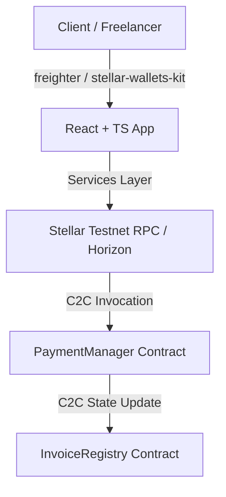
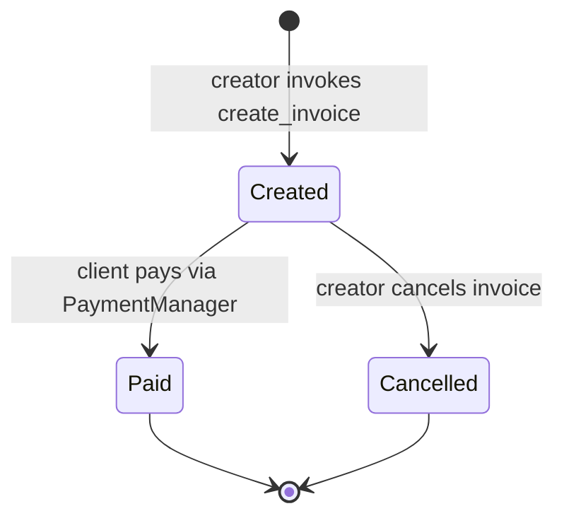
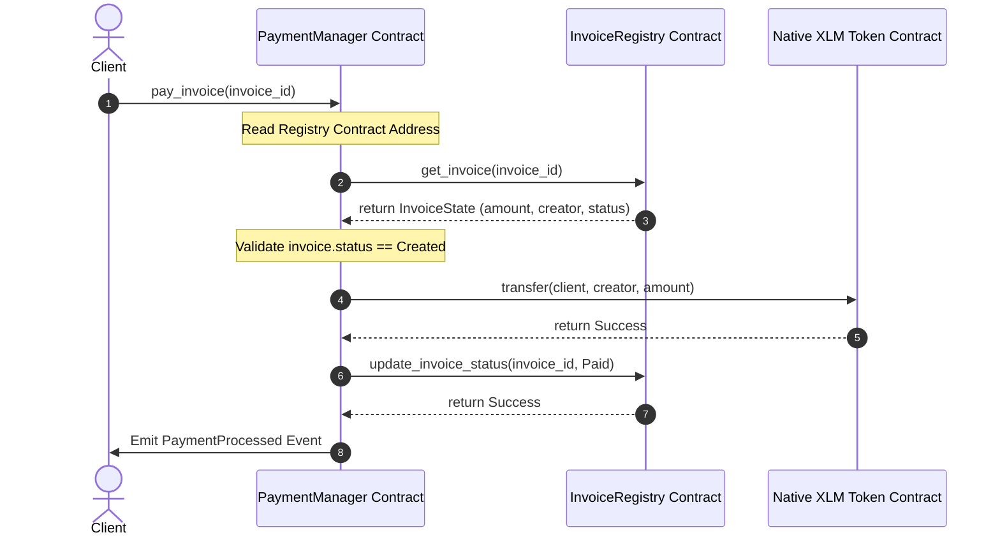
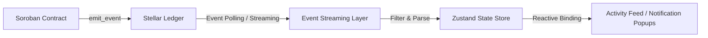
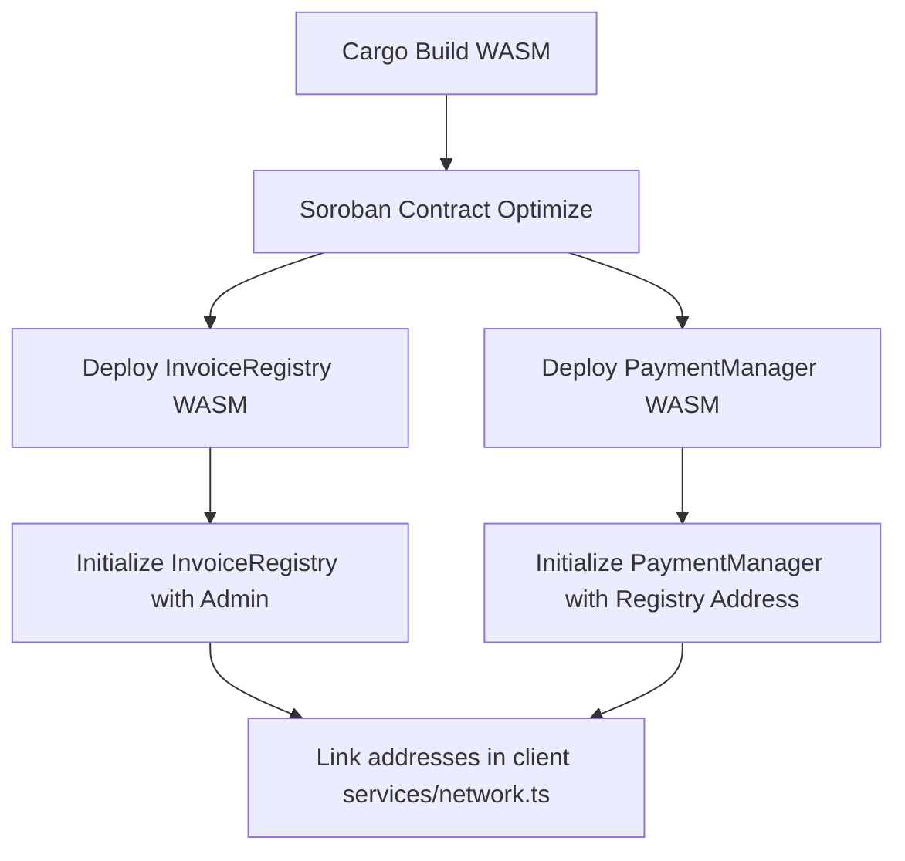

# InvoiceX Architecture & Design Specification

This document outlines the planning, architectural decisions, and diagrams for the InvoiceX platform, built on Stellar and Soroban.

---

## 1. System Topology

InvoiceX uses a decoupled multi-contract architecture where the **InvoiceRegistry** serves as the single source of truth for invoice records, and the **PaymentManager** orchestrates payments, validates states, and updates registry entries via contract-to-contract (C2C) calls.



---

## 2. Folder Structure Blueprint

```text
InvoiceX/
├── .github/
│   └── workflows/
│       └── ci-cd.yml
├── contracts/
│   ├── invoice_registry/
│   │   ├── src/
│   │   │   ├── lib.rs
│   │   │   └── types.rs
│   │   └── Cargo.toml
│   └── payment_manager/
│       ├── src/
│       │   └── lib.rs
│       └── Cargo.toml
├── docs/
│   └── architecture.md
├── src/
│   ├── components/
│   │   ├── Dashboard.tsx
│   │   ├── InvoiceForm.tsx
│   │   ├── InvoiceDetails.tsx
│   │   ├── TransactionCenter.tsx
│   │   └── ActivityFeed.tsx
│   ├── hooks/
│   │   └── useInvoiceX.ts
│   ├── lib/
│   │   └── stellar-kit.ts
│   ├── services/
│   │   ├── contract.ts
│   │   ├── events.ts
│   │   ├── logging.ts
│   │   ├── network.ts
│   │   └── wallet.ts
│   ├── state/
│   │   └── store.ts
│   ├── types/
│   │   └── index.ts
│   ├── utils/
│   │   └── helpers.ts
│   ├── tests/
│   │   ├── components.test.tsx
│   │   └── wallet.test.ts
│   ├── App.tsx
│   ├── index.css
│   └── main.tsx
├── Cargo.toml
├── package.json
└── README.md
```

---

## 3. Invoice State Machine

Invoices follow a strict, one-way state transition validation to prevent double-payments or illegal cancellations:



### State Constraints:
- An invoice can only transition from `Created` to `Paid` or `Cancelled`.
- Transitions from `Paid` or `Cancelled` to any other state are rejected with access control errors.

---

## 4. Inter-Contract Communication Flow



---

## 5. Event Emission & Subscription Architecture

All critical state transitions emit structured events to facilitate external indexing (e.g., via Mercury, Zephyr, or RPC polling):



### Event Structs:
- **`InvoiceCreated`**: `[invoice_id, creator, amount, client]`
- **`InvoicePaid`**: `[invoice_id, payer, amount]`
- **`InvoiceCancelled`**: `[invoice_id]`
- **`PaymentProcessed`**: `[invoice_id, amount, tx_hash]`

---

## 6. Deployment Architecture


